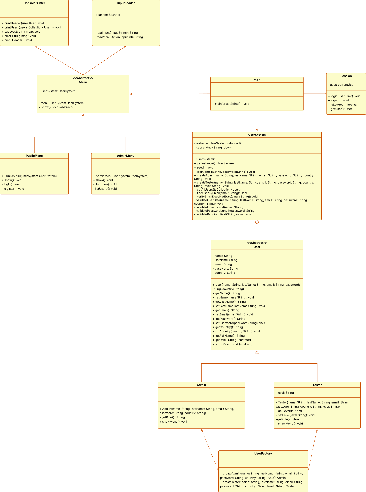

# CesAdmin

CesAdmin es una aplicación desarrollada en Java como parte del curso "Introducción a la programación para testers" del CES, orientada a la gestión de usuarios administradores y testers.

## Funcionalidades

#### 🔐 Login de usuario
* **Descripción:** Permitir a un usuario administrador autenticarse mediante la opción **"Iniciar Sesión"** del menú principal. El usuario debe ingresar un email y una contraseña. El sistema valida que las credenciales sean correctas y que no se introduzcan campos vacíos.
* **Datos utilizados:**
    * `email`: identifica al usuario admin que desea acceder al sistema.
    * `contraseña`: valida la identidad del usuario y permite el acceso al sistema.

#### 📝 Registro de usuario
* **Descripción:** Crear nuevos usuarios administradores mediante la opción **"Registrarse"** del menú principal. El usuario debe completar el formulario con los datos solicitados. El sistema valida que no se introduzcan campos vacíos, que el correo no exista para evitar usuarios duplicados y que las contraseñas coincidan.
* **Datos utilizados:**
    * `nombre`: nombre del administrador a registrar.
    * `apellido`: apellido del administrador a registrar.
    * `email`: dirección de correo electrónico del usuario.
    * `contraseña`: clave de acceso para ingresar al sistema.
    * `país de nacimiento`: país de origen del usuario.

#### 🔄 Reinicio de contraseña
* **Descripción:** Cambiar la contraseña de un usuario administrador mediante la opción **"Reiniciar Contraseña"** del menú principal. El usuario debe ingresar su email y la nueva contraseña. El sistema valida que el usuario exista, que no haya campos vacíos y que las contraseñas introducidas coincidan.
* **Datos utilizados:**
    * `email`: identifica la cuenta cuya contraseña será modificada.
    * `contraseña`: nueva clave de acceso del usuario.

#### 👥 Listado de usuarios
* **Descripción:** Muestra la lista de los usuarios registrados en el sistema mediante la opción **"Ver Usuarios"** del menú principal. Esta funcionalidad es accesible únicamente para usuarios administradores que hayan iniciado sesión previamente.
* **Datos utilizados:**
    * `nombre`: nombre del usuario registrado.
    * `apellido`: apellido del usuario registrado.
    * `email`: dirección de correo electrónico del usuario.
    * `país de nacimiento`: país de origen del usuario.
    * `perfil`: rol del usuario dentro del sistema (administrador o tester).

#### 🧪 Crear usuario tester
* **Descripción:** Permite registrar nuevos usuarios de tipo tester mediante la opción **"Crear Usuario"**. Esta funcionalidad es accesible únicamente para usuarios administradores que hayan iniciado sesión previamente.
* **Datos utilizados:**
    * `nombre`: nombre del tester.
    * `apellido`: apellido del tester.
    * `email`: dirección de correo electrónico del tester.
    * `contraseña`: clave de acceso del tester.
    * `país de nacimiento`: país de origen del tester.
    * `rol`: nivel del tester dentro del sistema (junior, senior o líder).

#### ❌ Eliminar usuario de tipo tester
* **Descripción:** Permite eliminar un usuario de tipo tester registrado del sistema mediante la opción representada por un ícono de papelera que se muestra en la columna **"Acción"** en la tabla **"Datos de usuarios"**, correspondiente a cada registro. Antes de realizar la eliminación del usuario, el sistema solicita confirmación para evitar borrados accidentales. Esta funcionalidad es accesible únicamente para usuarios administradores que hayan iniciado sesión previamente.
* **Datos utilizados:**
    * `email`: identifica al usuario que será eliminado.

#### 👤 Ver perfil del administrador
* **Descripción:** Permite al usuario administrador autenticado visualizar su información personal mediante la opción **"Perfil"** del menú del usuario.
* **Datos utilizados:**
    * `nombre`: nombre del administrador.
    * `apellido`: apellido del administrador.
    * `email`: dirección de correo electrónico del administrador.
    * `país de nacimiento`: país de origen del administrador.
    * `perfil`: rol del usuario dentro del sistema (administrador)

#### ✏️ Editar perfil del administrador
* **Descripción:** Permite al usuario administrador autenticado editar su información personal mediante la opción **"Perfil"** del menú del usuario.
* **Datos utilizados:**
    * `nombre`: nombre del administrador.
    * `apellido`: apellido del administrador.
    * `email`: dirección de correo electrónico del administrador.
    * `país de nacimiento`: país de origen del administrador.

#### 🚪 Cerrar sesión
* **Descripción:** Permite al usuario administrador autenticado finalizar la sesión activa mediante la opción **"Cerrar Sesión"**, regresando a la pantalla principal de la aplicación.
## Tecnologías utilizadas

## Diagrama de clases UML

